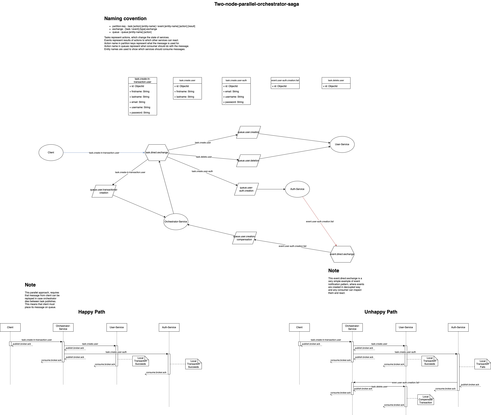

# **Saga Orchestrator Example**

This project demonstrates how to manage distributed transactions using the **Saga Pattern**, focusing on the
orchestrator-based approach. The implementation utilizes **RabbitMQ** and **Spring Boot** to achieve an event-driven
architecture with clear state management through tasks and events.

---

## **Overview**

The Saga pattern is employed to manage distributed transactions across multiple microservices. This example implements
the **Orchestrator Saga** approach, where a central orchestrator coordinates transactions between services. It showcases
both **happy** and **unhappy** paths to demonstrate how compensating transactions are handled.

### **Design Details**

- The application follows **Event-Driven Architecture** principles, using **tasks** and **events** for communication:
    - **Tasks**: Represent actions that request state changes in a service.
    - **Events**: Represent results of actions, enabling other services to react to state changes.
- **Compensating Transactions**: Used to revert state changes in case of transaction failures.
- **Message Replay**: This parallel approach requires that client messages can be replayed if the orchestrator dies
  between publishing tasks. Clients must place their messages on a queue to ensure reliability.
  See [Workflow 3.](#workflow)

---

## **Microservices**

This example includes two services:

1. **User-Service**:
    - Manages general information about the user.
2. **Auth-Service**:
    - Manages user credentials such as `username`, `email`, and `password`.

---

## **Workflow**

1. A client places a message on a queue, ensuring replay capability.
2. The **Orchestrator** picks up the client message and publishes parallel tasks to the `Auth-Service` and
   `User-Service`.
3. If a failure occurs in `Auth-Service` (e.g., `username` or `email` already exists), the orchestrator triggers
   compensating tasks in `User-Service` to roll back changes.

---

## **Happy Path vs. Unhappy Path**

The workflow has two possible outcomes:

1. **Happy Path**:
    - Both `Auth-Service` and `User-Service` successfully process their respective tasks.
    - The transaction completes without any need for compensation.

2. **Unhappy Path**:
    - `Auth-Service` fails to process the task (e.g., due to duplicate username/email).
    - The orchestrator compensates by rolling back changes in `User-Service`.

---

## **Key Concepts**

### **Tasks and Events**

- **Tasks**:
    - Represent actions that modify a service's state.
    - Example: `CreateUserTask`, `CreateAuthTask`.
- **Events**:
    - Represent results of tasks that notify other services.
    - Example: `UserCreatedEvent`, `AuthCreationFailedEvent`.

### **Naming Convention**

- **Partition Key**: Defines task and event routing keys.
    - Format: `task.[action].[entity-name]` / `event.[entity-name].[action].[result]`.
    - Example: `task.create.user` or `event.user.create.failed`.
- **Exchange**: Determines the message exchange type.
    - Format: `[task/event].[type].exchange`.
    - Example: `task.direct.exchange`.
- **Queue**: Defines the queue name for consumers.
    - Format: `queue.[entity-name].[action]`.
    - Example: `queue.user.create`.

### **Purpose of Naming**

- Task names show what action is requested to change a service's state.
- Event names communicate state changes to other services.
- Entity names determine which services should handle tasks or events.

### **Parallel Messaging and Replay**

- The **event.direct.exchange** is an example of the **event notification pattern**, where events are created in a
  decoupled manner.
- This allows any consumer to inspect and react to them as needed.
- By placing client messages on a queue, tasks can be replayed in case the orchestrator fails.

---

## **Diagram**

The architecture and workflow are illustrated in the diagram below:

---

## **Orchestrator vs. Choreography**

### **Orchestrator Saga** (used in this project)

- Centralized control via an orchestrator service.
- The orchestrator directs the workflow by publishing tasks and reacting to events.

### **Choreography Saga**

- Decentralized control where services react to events and trigger actions independently.

---

## **Technology Stack**

- **Java**: Spring Boot framework for building microservices.
- **RabbitMQ**: Message broker for managing communication between services.
- **Draw.io**: Used to create the system design diagram.

---

## **Future Improvements**

- Add more services to demonstrate complex workflows.
- Implement the **Choreography Saga** pattern for comparison.
- Add persistent storage for events to ensure reliability in case of orchestrator failures.
- Include end-to-end testing and monitoring tools.

---

Feel free to explore the project and contribute!
